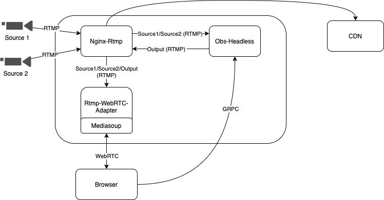
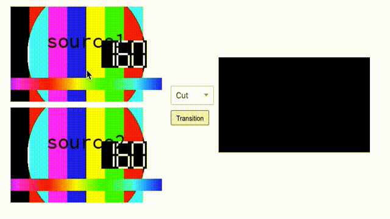

## Overview
A example project to create a browser-based switcher application using WebRTC.

## Architecture


## WebRTC Advantage
1. Browser support
2. Low latency

## Dependent services
1. obs-headless: https://github.com/MengLi619/obs-headless
2. rtmp-webrtc-adapter: https://github.com/MengLi619/rtmp-webrtc-adapter

## Run the project
1. Run dependent services
    ```shell script
    cd docker-compose && docker-compose up -d && cd ..
    ```
   
2. Run client
    ```shell script
    npm start
    ```
   
3. Clean up
    ```shell script
    cd docker-compose && docker-compose down && cd ..
    ``` 
   
## ScreenCut

    
## Further improvement
Support webrtc output in obs-headless, to continue reduce the latency.
